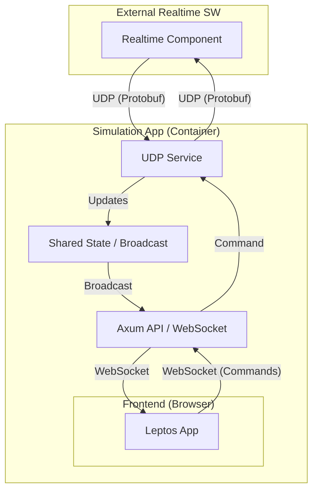

# Implementation Plan - Rust Hackathon Project

## Goal Description
Build a full-stack Rust application acting as a **Simulation** component that communicates with a **Realtime** component via UDP.
The app will visualize real-time data and allow user control via a web interface.

**Key Features:**
- **Backend:** Axum (HTTP/WebSocket) + Tokio (UDP)
- **Frontend:** Leptos (WASM)
- **Communication:** UDP with Protobuf serialization (referencing `operSystem_api_realtime.proto`)
- **Deployment:** Single Docker container (Windows/Linux support)

## User Review Required
> [!IMPORTANT]
> **Missing Reference File**: The prompt mentioned `docker-sec-agent.md`, but it was not found in the workspace. I have proceeded based on standard practices and the provided proto file.
>
> **UDP Wire Format**: The proto file defines messages but not the exact UDP wire format (e.g., how to distinguish message types on the wire).
> **Assumption**: I will implement a `MessageWrapper` enum in the shared crate containing `oneof` all supported messages, or use a simple 1-byte header if a specific standard is required. **Please clarify if a specific wire format is mandated.**

## Proposed Architecture

### 1. Project Structure
Workspace-based architecture to share code between backend and frontend.

```text
rust-hackathon/
├── Cargo.toml              # Workspace root
├── shared/                 # Shared logic & types
│   ├── src/
│   │   ├── lib.rs
│   │   ├── proto.rs        # Generated Protobuf code
│   │   └── models.rs       # Shared domain models
│   └── build.rs            # Protobuf compilation
├── backend/                # Axum server & UDP service
│   ├── src/
│   │   ├── main.rs
│   │   ├── udp.rs          # UDP listener/sender
│   │   ├── state.rs        # AppState & Shared Data
│   │   └── api.rs          # HTTP & WebSocket handlers
├── frontend/               # Leptos Web App
│   ├── src/
│   │   ├── main.rs
│   │   ├── app.rs
│   │   └── components/     # UI Components
└── docker/
    └── Dockerfile          # Multi-stage build
```

### 2. Module Architecture



### 3. Crate Dependencies

**Shared:**
- `prost`, `prost-types`: Protobuf support
- `serde`, `serde_json`: Serialization
- `chrono`: Time handling

**Backend:**
- `axum`: Web framework
- `tokio`: Async runtime (full features)
- `tower-http`: CORS, static files
- `tracing`, `tracing-subscriber`: Logging
- `dashmap` or `tokio::sync::RwLock`: State management

**Frontend:**
- `leptos`: Web framework
- `leptos_router`: Routing
- `wasm-bindgen`, `web-sys`: DOM interop
- `gloo-net`: WebSocket client

### 4. Backend API Design

**Routes:**
- `GET /`: Serve frontend (HTML/WASM)
- `GET /ws`: WebSocket endpoint for bi-directional communication
- `GET /api/status`: Health check

**WebSocket Protocol:**
- **Server -> Client**: JSON serialized updates (e.g., `SensorUpdate`, `SystemStatusUpdate`)
- **Client -> Server**: JSON serialized commands (e.g., `SendActuatorCommand`, `SetSimulationState`)

### 5. UDP Communication Service
- **Listener**: Binds to a UDP port (e.g., 5000). Runs in a separate Tokio task.
- **Sender**: Sends packets to the Realtime component's IP/Port.
- **Serialization**: Uses `prost` to encode/decode Protobuf messages.
- **Dispatch**: Matches incoming messages (heuristic or wrapper) and updates Shared State.

### 6. Frontend Component Hierarchy
- `App`
  - `NavBar` (Connection Status)
  - `Dashboard`
    - `SensorDisplay` (Charts/Gauges for `SensorReading`)
    - `SystemStatusPanel` (Display `SystemStatus`)
    - `ControlPanel` (Forms for `ActuatorCommand`)
  - `LogView` (History of messages)

### 7. Docker Deployment
Multi-stage Dockerfile:
1. **Builder (Base)**: Rust toolchain
2. **Frontend Builder**: Install `wasm-pack`, build Leptos app (release)
3. **Backend Builder**: Build Axum binary (release)
4. **Runtime**: `debian:bookworm-slim` (or `alpine` if static linking is easy).
   - Copy binary and static assets (wasm, js, css).
   - Expose ports (HTTP: 3000, UDP: 5000).

## Verification Plan

### Automated Tests
- **Unit Tests**:
  - Test Protobuf serialization/deserialization in `shared`.
  - Test State logic in `backend`.
- **Integration Tests**:
  - Spawn Backend and Mock UDP Sender.
  - Verify Backend receives UDP and broadcasts to WebSocket (using a tungstenite client).

### Manual Verification
1. **Build & Run**:
   ```bash
   docker build -t rust-hackathon .
   docker run -p 3000:3000 -p 5000:5000/udp rust-hackathon
   ```
2. **Browser Check**:
   - Open `http://localhost:3000`.
   - Verify UI loads.
3. **UDP Simulation**:
   - Use `netcat` or a simple Rust script to send a valid Protobuf payload to localhost:5000.
   - **Verify**: UI updates with the data.
4. **Command Check**:
   - Click "Send Command" in UI.
   - **Verify**: Listener (netcat) on the other side receives the UDP packet.

## Step-by-Step Implementation Phases
1. **Setup**: Initialize workspace, crates, and `build.rs` for Protobuf.
2. **Shared**: Generate Rust code from `.proto`.
3. **Backend Core**: Implement UDP listener and basic State.
4. **Frontend**: Setup Leptos and basic UI.
5. **Integration**: Connect Backend UDP -> State -> WebSocket -> Frontend.
6. **Command Flow**: Frontend -> WebSocket -> Backend -> UDP Sender.
7. **Docker**: Create and verify Dockerfile.
